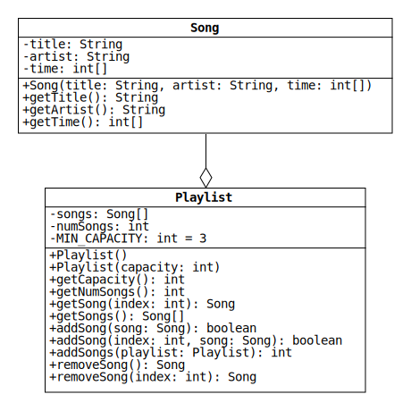

# Lab 4: Aggregating Songs

## Special Topic - Git with the Command Line

In the previous two labs, we used GitHub's browser interface to download the starter code and commit our changes to a remote repository.
This week, we are going to use the command line.
If you haven't done so already, navigate to [this site](https://git-scm.com/downloads) and follow the instructions to install Git on your computer.

Once you're finished, open a terminal in the folder where you want to download the starter code.
macOS users, take a look at [this Stack Exchange thread](https://apple.stackexchange.com/questions/11323/how-can-i-open-a-terminal-window-directly-from-my-current-finder-location) for instructions on opening Terminal from a Finder window.
Windows users, navigate to the folder in File Explorer, right-click on the window, and select "Git Bash Here" from the context menu.

Now read our brief [Git command-line tutorial](./git.md) to learn how to clone your GitHub repo (download the starter code).
Follow the instructions and then import the resulting folder into Eclipse with the "Open Projects from File System..." or "Import..." dialog, just like with past assignments.

Work on the assignment as usual, but leave your terminal window open.
After you pass the first unit test, finish reading the tutorial and then use the command line to commit and push your work to GitHub.
This may seem tedious at first, but you will soon realize that it's more convenient than using a web browser.

## Introduction

In object-oriented programming, aggregation is a relationship between two classes where objects of one class contain objects of the other.
In this lab, we will implement two such classes: Song and Playlist.
Each object of the Song class represents a single musical composition.
Each object of the Playlist class represents an ordered, modifiable list of songs.

Aggregation is represented in UML diagrams by a line with an empty diamond on
one end that connects two classes.
Objects of the class touching the diamond contain objects of the other class.
The following is a class diagram for the Song and Playlist classes:

## Song Class

Each Song object contains two Strings and an integer array.
These fields store the title, artist, and duration (time) of a song.

The time array has either one, two, or three elements that store the number of seconds, minutes, and hours, respectively.
Each element is greater than or equal to 0, and the seconds and minutes are limited to the inclusive range from 0 to 59.
If the duration of the song is less than an hour, the hours element is omitted.
Similarly, if the song is less than a minute, both the minutes and hours elements are omitted.

Consider, for example, the song "So What" by Miles Davis, which is 9 minutes and 22 seconds long.
A Song object that contains this data will store "So What" and "Miles Davis" in the title and artist fields, and it will store [22, 9] in the time field.
The array has only two elements because the duration of the song is less than an hour.

In the previous lab, we used encapsulation to handle invalid input passed to a class's constructor and setters.
In this lab, we will **assume that the Song constructor is always given valid data**.
In particular, we will assume that the integer array always satisfies the description above.

Instead of checking the constructor input for errors, we're going to use encapsulation for another purpose: to make Song objects [immutable](https://en.wikipedia.org/wiki/Immutable_object).
This means that the state of a Song cannot change after it is constructed.

Notice that the Song class does not have any setters.
This prevents the title and artist fields from changing.
It does not, however, prevent the time array from changing.
If the user of our class has a reference to the array, the reference can be used to change the elements without a setter.
(Why isn't this a problem for the String fields?)

To keep this from happening, make copies of the time array.
Note that a copy must be made in two methods: (1) in the constructor, before assigning the reference to the time field, and (2) in getTime, before returning the reference.
To simplify your code, try using the copyOf method from the [Arrays class](https://docs.oracle.com/en/java/javase/11/docs/api/java.base/java/util/Arrays.html) instead of a for-loop.

## Playlist Class

Each Playlist object contains a reference to an array of Song objects that is stored in the songs field.
When a Playlist object is constructed, a new Song array is also constructed.
The array is initially empty, but Songs can be added and removed by calling the methods addSong, addSongs, and removeSong.

In CS 1323/4, we used the adjective "oversize" to describe arrays such as this, which have extra space for adding data.
An oversize array has both a capacity and a size.
The capacity is the length of the array, and the size is the number of elements treated as non-empty.
(For instance, if an array has a capacity of 8 and a size of 6, we treat the first 6 elements as valid data and the last 2 as empty space.)
In a Playlist object, the size of the Song array is stored in the numSongs field.

Below are descriptions of how each Playlist method should work:

* `Playlist()`: Initialize a Playlist with an empty Song array of length `MIN_CAPACITY`.

* `Playlist(int capacity)`: Initialize a Playlist with an empty Song array of the given capacity.
If the capacity is less than `MIN_CAPACITY`, use `MIN_CAPACITY` instead.

* `getCapacity()`: Return the length of the Song array.

* `getNumSongs()`: Return the number of Songs in the array (i.e., the field numSongs).

* `getSong(int index)`: Return the Song with the given index in the array.
If the index is less than 0 or greater than the index of the last Song, return null.

* `getSongs()`: Return a copy of the Song array with no extra space.
That is, the length of the new array should be equal to the number of Songs.
(In CS 1323/4, we used the adjective "perfect size" to describe arrays like this.)

* `addSong(Song song)`: Assign the given Song to the first empty element of the array and return true.
If the array is full, leave it unchanged and return false.
(Use the other addSong method to implement this method in a single line.)

* `addSong(int index, Song song)`: Add the given Song to the array at the given index and return true.
Before assigning the Song, shift the existing Songs with indices greater than or equal to the given index up to the next-highest index.
If any of the following conditions is true, leave the array unchanged and return false:
  * The array is full.
  * The given index is less than 0 or greater than the index of the last Song plus 1.
  * The Song reference is null.

* `addSongs(Playlist playlist)`: Add the Songs in the given Playlist to the end of the array in the given order.
If there is insufficient space to add them all, add as many as will fit.
Return the number of Songs that were added.
If the Playlist reference is null, return 0.

* `removeSong()`: Remove and return the last Song in the array.
If the array is empty, return null.
(Use the other removeSong method to implement this method in a single line.)

* `removeSong(int index)`: Remove and return the Song with the given index in the array.
Before returning the Song, shift the Songs with larger indices down to the next-lowest index.
If there is no Song in the array with the given index, return null.

## Hints

* Treat the field numSongs as an accumulator that tracks the number of Songs in the array.
When a Song is added, increment the variable.
When a Song is removed, decrement it.

* The value of numSongs should be used along with the capacity to determine whether the Song array can be modified.
For example, suppose that numSongs is equal to the capacity.
In this case, there is no empty space, so no Songs can be added.

* The removeSong methods can be written to set unused elements to null, but this is not a requirement.
(In an oversize array, any element with an index greater than or equal to the size is treated as empty space, regardless of whether it is null.)
